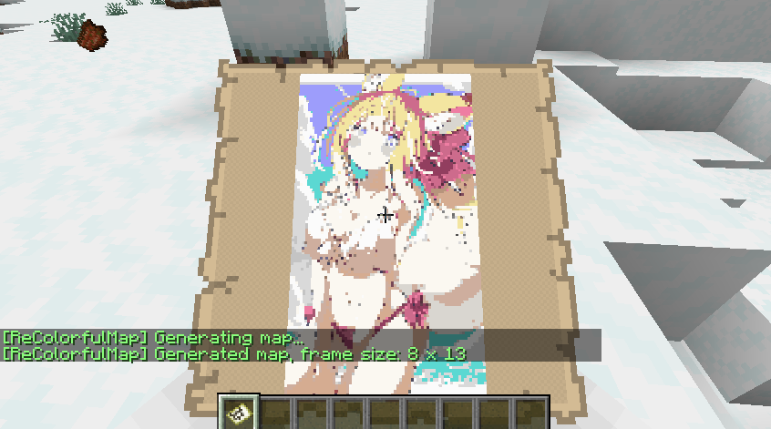
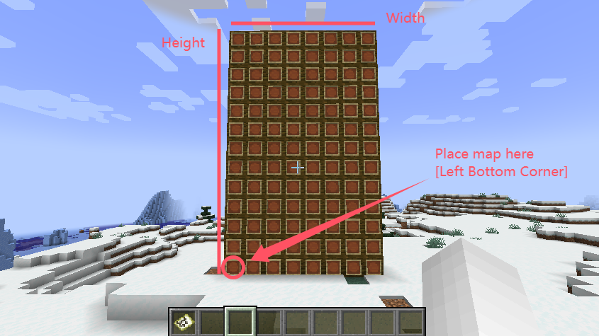
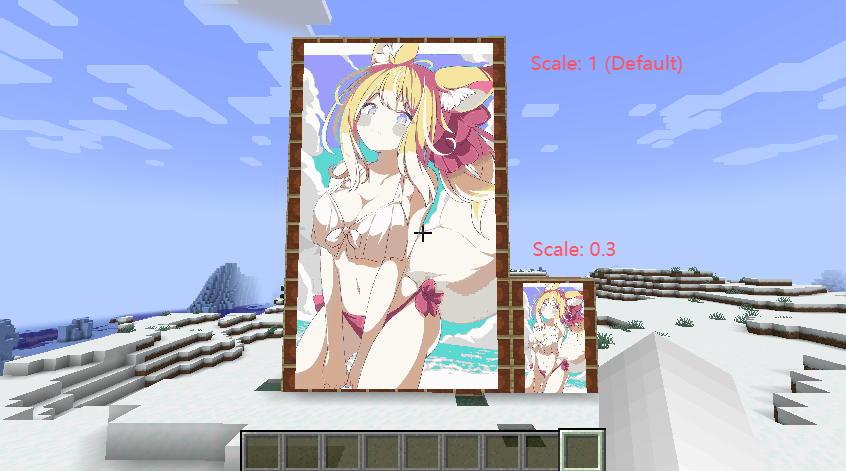

<div align="center">

# ReColorfulMap


[](https://github.com/ColdeZhang/ReColorfulMap)
[](https://bstats.org/plugin/bukkit/ColorfulMap/21443)
[](https://github.com/ColdeZhang/ReColorfulMap/releases/latest)

</div>

## Description

ReColorfulMap is a plugin that converts images into image maps, which can be hung on item frames to add decoration.

This is a remake of the original ColorfulMap plugin. The original plugin leaves a lot of images cache in plugins folder,
and need to reload them every time the server starts. Which also increases the server startup time and management
difficulty.

Both ColorfulMap and ReColorfulMap's idea are from [ImageFrame](https://github.com/LOOHP/ImageFrame)
and [ImageMaps](https://github.com/SydMontague/ImageMaps).
You can think it is a simplified version of ImageFrame and a high version remake of ImageMaps. Thanks for their great
work.

## Features

- Convert images into image maps;
- Image scaling;
- Automatic placement to item frame matrix;
- Support for consuming money to generate map paintings (requires Vault dependency);
- Automatic get back maps from item matrix **(new feature)**;

## Version Support

- 1.20.1+ (Paper、Folia)

## Usage

1. First, you need to upload the image you want to convert to the [image bed](https://ssl.lunadeer.cn:14437/),
   so that this plugin can read the image content from the network. After uploading,
   you will get an url of the image, copy this address.

2. In the game, enter the command: `/tomap <url-you-just-got>` to get a map:

   

   Because one map can only hold an image at the most of 128 x 128 pixels, so ReColorfulMap will split your image into
   tiles automatically.
   Don't worry about handling the tiles, ReColorfulMap will tell you how many item frames you need to place this image
   maps
   and place them in the correct order automatically too.

   For this image shown above, it shows 8 x 13, which means you prepare a matrix of item frames 8 in width and 13 in
   height to place this image.

3. Place the map in the **bottom-left corner** of the item frame matrix, then the corresponding maps will be placed in
   the remaining item frames on the wall automatically.

   

4. If the image is too large or too small, you can try to add a scaling parameter after the command,
   for example, `/tomap <url-you-just-got> 0.3` means rendering at 30% of the original size.
   If you want to fill the image without leaving any white space at the edges of all the maps,
   you need to ensure that the resolution of your image is a multiple of **128**.

   

## For Server Owners

### Commands & Permissions

> The angle brackets `<>` in the following commands indicate required parameters, and the square brackets `[]` indicate
> optional parameters.

| Function    | Command                         | Permission Node     | Default |
|-------------|---------------------------------|---------------------|---------|
| Generate    | `/tomap <image-url> [scalling]` | recolorfulmap.tomap | true    |
| Reload      | `/reloadColorfulMap`            | recolorfulmap.admin | op      |
| Clean Cache | `/cleanColorfulMap`             | recolorfulmap.admin | op      |

NOTICE: Don't run `/cleanColorfulMap` frequently, it will delete all the images generated but not placed.

### Configuration Reference

```yaml
# Do not modify this value.
version: 2
# The maximum size of item frame matrix.
# 32 x 18 means image can not be larger than 4096 x 2304 pixels.
# Don't set this value too large, it may cause lag.
max-frame-x: 32
max-frame-y: 18
# Language of the plugin, see others in the plugins/FurnitureCore/languages folder.
language: ch
# Enable economy system. (Require Vault and an economy plugin)
# If true, players need to pay for each map they create.
# This may prevent players from abusing usage of the plugin.
economy:
   enable: false
   cost-per-map: 100.0
# The whitelist of image url address, use this to prevent players from using inappropriate images.
# Leave it empty to allow all addresses.
address-white-list:
   - ''
# Debug mode, if report bugs turn this on.
debug: true
```

## Support

Mail: [zhangyuheng@lunadeer.cn](mailto:zhangyuheng@lunadeer.cn)

GitHub: [Issues](https://github.com/ColdeZhang/ReColorfulMap/issues)

QQ群：309428300

## 统计


